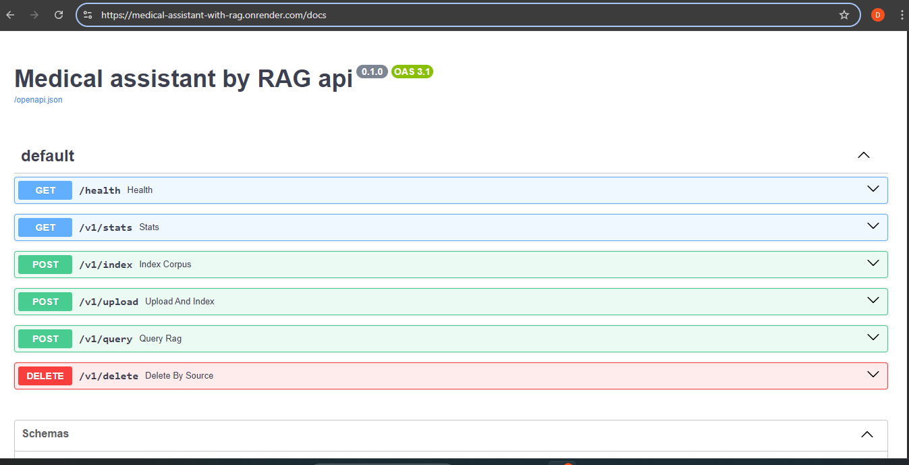
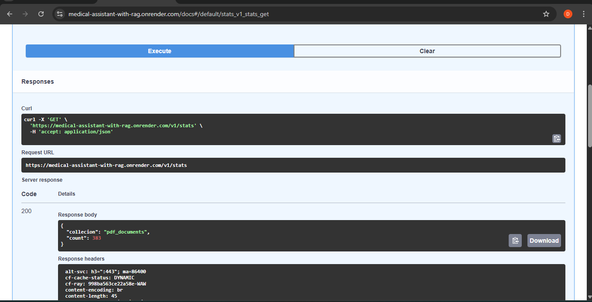
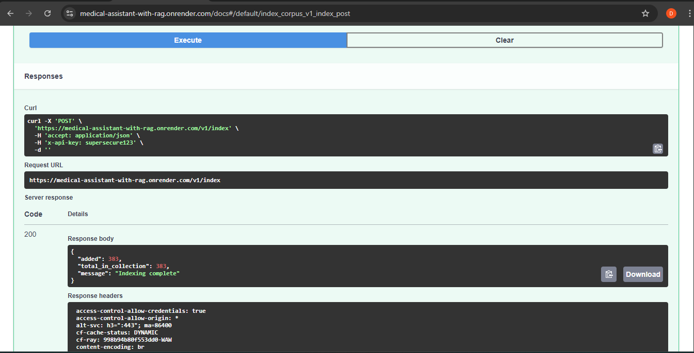
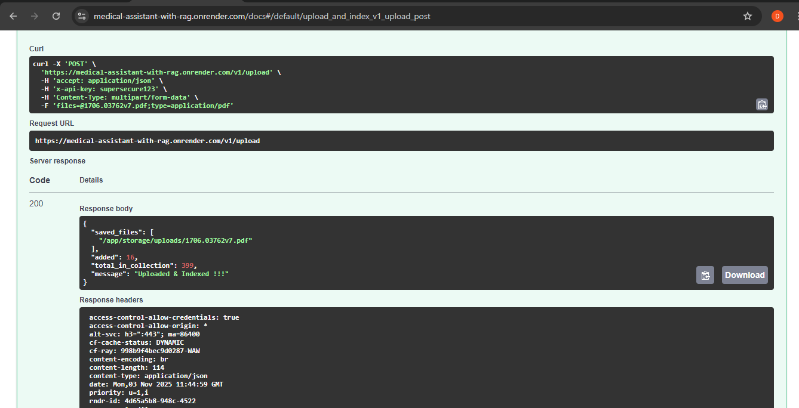
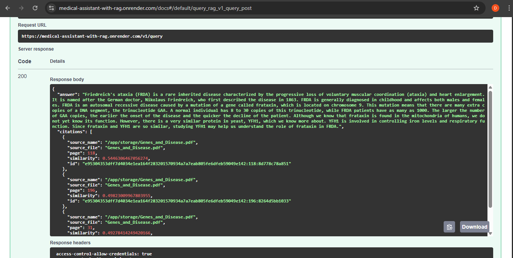
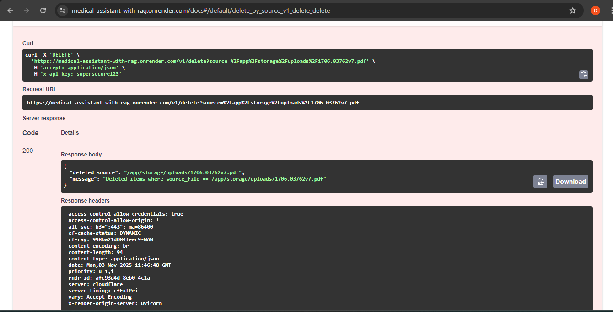

# Medical Assistant with RAG

>[Med-assistant LLM](https://github.com/diyorarti/Medical-assistant) powered with RAG **Retrieval-Augmented Generation** that answers med-related questions using over your curated PDF knowledge base and defaut [PDFs](https://github.com/diyorarti/Medical-assistant-with-RAG/blob/main/labs/project-lab.ipynb).

[](https://fastapi.tiangolo.com/)
[](https://www.trychroma.com/)
[](https://www.sbert.net/)
[](https://huggingface.co/diyorarti/med-mixed-merged)
[](https://www.docker.com/)
[](#-license)

---
## 📖 Table of Contents
- [Features](#-features)
- [Project Overview](#-project-overview)
- [Tech Stack](#-tech-stack)
- [Architecture](#-architecture-high-level)
- [Project Structure](#-project-structure)
- [Installation](#️-installation)
- [Usage & Examples](#-usage--examples)
- [Deployment](#️-deployment)
- [Screenshots](#-screenshot)
- [License & Acknowledgements](#-license)

---
## ✨ Features

- **Context-Aware Q&A:** Retrieves relevant medical information from uploaded PDFs and default [knowledge base](https://github.com/diyorarti/Medical-assistant-with-RAG/blob/main/labs/project-lab.ipynb) before generating answers.  
- **Retrieval-Augmented Generation (RAG):** Combines vector-based document search (ChromaDB) with an [Fine-tuned LLM](https://huggingface.co/diyorarti/med-mixed-merged) for accurate, reference-supported responses.  
- **Multi-Source Document Support:** Handles multiple uploaded medical documents, automatically chunked and embedded for efficient retrieval.  
- **Fast and Scalable API:** Built with FastAPI and Docker for seamless deployment and real-time interaction.  
- **Custom Embedding Pipeline:** Uses SentenceTransformers (`all-MiniLM-L6-v2`) for precise vector representation of text.  
- **Swagger UI Documentation:** Provides interactive API exploration for developers.  
---

## 🩺 Project Overview

In healthcare and medical research, professionals often face challenges in finding precise and trustworthy information buried within lengthy documents. Manual searching not only wastes time but increases the risk of overlooking critical insights.

**Medical Assistant with RAG** provides an intelligent solution by combining *retrieval-augmented generation (RAG)* and *large language models (LLMs)*. Users can upload medical PDFs, ask natural-language questions, and receive accurate, context-rich answers grounded in the uploaded sources.

Technically, the system uses **LangChain**, **ChromaDB**, and **SentenceTransformers (all-MiniLM-L6-v2)** for vector-based retrieval, and connects to **Hugging Face** or **Grok (xAI)** APIs for language generation. The backend is implemented with **FastAPI**, containerized with **Docker**, and deployed via **Render**, providing real-time, scalable access.

---

## ⚙️ Tech Stack

| Area | Technologies |
|------|---------------|
| **Programming Language** | Python |
| **Framework** | FastAPI |
| **RAG Components** | LangChain, SentenceTransformers, ChromaDB |
| **Embedding Model** | all-MiniLM-L6-v2 |
| **LLM Providers** | Hugging Face Endpoint, Grok(optional) |
| **Vector Database** | ChromaDB |
| **Document Processing** | PyPDFLoader, RecursiveCharacterTextSplitter |
| **Containerization** | Docker |
| **Deployment** | Render |
---

## 🧱 Architecture (High-Level)
The project implements a Retrieval-Augmented Generation (RAG) pipeline that combines local document retrieval with remote LLM inference.  
Below is the high-level data and control flow within the system:
```bash
             ┌─────────────────────────────┐
   PDFs -->  │ data/ (RAD-dev-pdfs)        │
             │ data/uploads (user-uploaded)│ 
             └───────────────┬─────────────┘
                             │  load_data() - (langchain_community.document_loaders -> PyPDFLoader)
                             ▼
                      ┌───────────────┐
                      │  CHUNKER      │  ← cleans & splits PDF text (langchain -> RecursiveCharacterTextSplitter)
                      │ (Recursive)   │     (helpers.normalize_text)
                      └───────┬───────┘
                              │  texts + metadata
                              ▼
                      ┌───────────────┐
                      │  EMBEDDER     │  ← SentenceTransformers ("all-MiniLM-L6-v2" model )
                      │               │     (batch, normalized)
                      └───────┬───────┘
                              │  vectors + metadata (deterministic IDs)
                              ▼
                      ┌────────────────┐
                      │   ChromaDB     │  ← persistent vector store
                      │ (collection)   │
                      └───────┬────────┘
                              ▲
                       retrieve(top_k, threshold)
                              │
                      ┌───────┴─────────┐
                      │   FastAPI       │
                      │   Routers:      │
                      │  /v1/index      │   (build index from default PDFs)
                      │  /v1/upload     │   (upload PDFs + index)
   client question -> │  /v1/query      │   (LLM Providers: • HF Endpoint(default) (GROK optional))
                      │  /v1/delete     │   (Delete the indexed source)
                      |  /root          |
                      │  /health        │   
                      │  /v1/stats      │  
                      |  /v1/debug/ls   |     
                      └─────────────────┘
```
---
## 📁 Project Structure
```bash
medical-assistant-with-rag/
│
├── .vscode/ # VSCode workspace settings
├── assets/ # project related pictures
├── data/ # Knowledge base and vector store
│ ├── cache/ # Cache of chunks and embeddings
│ │ ├── chunks.pkl
│ │ ├── embeddings.npy
│ │ └── manifest.json
│ ├── uploads/ # User Uploaded PDFs for knowledge base
│ │ └── 1706.03762v7.pdf # example of user uploaded file 
│ └── vector_store/ # ChromaDB persistence
│ ├── chroma.sqlite3
│ ├── Aging_natural_or_disease.pdf # RAG-dev-knowledge base
│ ├── Genes_and_Disease.pdf # RAG-dev-knowledge base
│ └── basic_epidemiology.pdf # RAG-dev-knowledge base
│
├── hf-cache/ # Local Hugging Face model cache
│
├── labs/ # Research notebooks and experiments
│ ├── project-lab.ipynb # RAG development lab
│ └── requirements.txt # packages used in LAB experiment
│
├── rag/ # Core application package
│ ├── api/ # FastAPI endpoints, routers, and services
│ │ ├── routers/
│ │ ├── schemas/
│ │ ├── services/
│ │ └── main.py # FastAPI entry point
│ │
│ ├── core/ # App configuration and security
│ │ ├── config.py # Loads environment variables
│ │ └── security.py # API key verification
│ │
│ ├── pipeline/ # RAG pipeline components
│ │ ├── LLM/ # Large Language Model interfaces
│ │ ├── chunker.py # Text chunking logic
│ │ ├── data_loader.py # PDF loader and parser
│ │ ├── embedder.py # Embedding generation
│ │ ├── retriever.py # Retrieves relevant chunks from vector store
│ │ ├── vector_store.py # Handles ChromaDB operations
│ │ ├── hf_rag_pipeline.py # RAG pipeline using Hugging Face models
│ │ └── grok_rag_pipeline.py # Optional RAG pipeline using Grok
│ │
│ ├── test/ # Unit & dev-level tests
│ │ └── rag_pipeline_dev.py
│ │
│ └── utility/ # Helper utilities
│   └── helpers.py # Text normalization, hashing, etc. 
│
├── .dockerignore
├── .gitignore
├── .env # Environment variables (not for Git)
├── Dockerfile # Docker setup
├── LICENSE
├── pyproject.toml # Project dependencies and metadata
└── README.md # Project documentation
```


## ⚙️ Installation

### 🧩 Prerequisites
Before you begin, ensure you have the following installed:

- **Python 3.10+**
- **pip** or **conda** for package management
- *(Optional)* **Docker 24+** if you prefer containerized deployment

---

### 🗂️ Clone the Repository

```bash
git clone https://github.com/diyorarti/Medical-assistant-with-RAG.git
cd Medical-assistant-with-RAG
```

### running project locally
```bash
uvicorn rag.api.main:app --reload
```

## 💻 Usage 

## ☁️ Deployment
### 🐳 2. Building and Run  Docker image
```bash
# buiding docker image
docker build -t medical-assistant-rag .
# running image
docker run --rm -it `
  --env-file .env `
  -p 8000:8000 `
  -v "${PWD}/data:/app/data" `
  -v "${PWD}/hf-cache:/root/.cache/huggingface" `
  --name medrag medrag-api:latest
```

### 🚀 Deploy on Render
Project deployed on [Render](https://medical-assistant-with-rag.onrender.com/docs)
Note: Once I deployed the project on Render successfully,then I stopped the paid subscription version of Render due to finiancial reasons, now it does not work, because min 2+ Ram and 5+ memory are required to run this project.
### ⚙️ Steps to Deploy on Render
**1. Create a new Web Service on Render:**

Go to https://render.com
Click “New +” → “Web Service”
Connect your GitHub repo
Select your repo → click Connect
**2. Render build settings:**

Environment ->	Docker
Region	Closest to you
Instance Type	✅ Standard (2 GB RAM) (avoid free tier for embeddings)
**3. Attach a Persistent Disk**

In the service → Settings → Disks → Add Disk
Name: storage
Mount Path: /app/storage
Size: e.g. min 5 GB
This disk stores:
PDFs (DATA_DIR)
Vector store (Chroma)
Hugging Face cache
**4. Add environment variables**

Go to Settings → Environment → Add Environment Variable
| Key |	Value |
|------|--------------------|
| HF_TOKEN | HuggingFace access token |
| GROK_API_KEY | XAI api key |
| DATA_DIR |	/app/storage |
| PERSIST_DIRECTORY_VS |	/app/storage/vector_store |
| HF_HOME |	/app/storage/hf-cache |
| HUGGINGFACE_HUB_CACHE |	/app/storage/hf-cache |
| API_KEY |	(your secret key — used in verify_api_key) |


## 📸 Screenshot
 ### ALL APIs

when I got the picture, the debug endpoint was running, then I removed it . 
---
### stats endpoint

---
### index endpoint

---
### upload endpoint 

---
### query endpoint 

---
### delete endpoint 

---

### 📄 License
MIT License

### 🙏 Acknowledgements

[LangChain](https://www.langchain.com/)                                                                             
[SentenceTransformers](https://www.sbert.net/)  
[ChromaDB](https://www.trychroma.com/)                                
[FastAPI](https://fastapi.tiangolo.com/)                                                  
[Hugging Face](https://huggingface.co/)                                                 
[HF-Endpoint(LLM)](https://huggingface.co/diyorarti/med-mixed-merged)
[Med-assistant-with-RAG-API](https://medical-assistant-with-rag.onrender.com/docs)                                               
[GROK(LLM)](https://x.ai/)                                                  